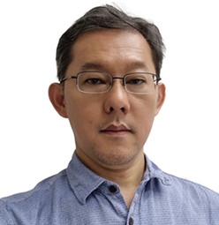

jimtoh.github.io

I am striving to become an AI Engineer. It's back to the trenches, beyond the comfort of a steadfast track, into winding roads filled with discovery.

I have completed a NTU PACE or Academy for Professional and Continuing Education -Advanced Professional Certificate in Data Science and AI, this end July 2025. Check out NTU PACE or Academy for Professional and Continuing Education:- https://www.ntu.edu.sg/pace/

This full time course, about 3 months, prepares me for careers in Data Science, Data Engineering, Machine Learning, and AI. From Python and SQL, Big Data Engineering to Machine Learning and Generative AI as well as Full Stack Programming, I have learned to apply such tech skills in practical ways.

Other notable professional upskilling include:
1. Professional Certificate in Machine Learning Operations (MLOps), NUS
2. AIAP Foundation - Project-based learning on ML pipelines, AI Singapore
3. NVIDIA - Certified Associate: Generative AI LLMs, NVIDIA

**Never stop learning**

Posted 20 Nov 2025

---

Welcome.

In June 2024, after working for over 27 years at ST Engineering (no less under three UENs), I decided to take a break but was fortunate to quickly hold myself accountable by attending a few short but fulfilling 'sprints' in adult learniing programmes conducted by NUS Advanced Computing for Executives (ACE).

One of the notable programmes is the Professional Certificate in Business Analytics.

- The program equips learners with essential skills in data-driven decision-making. Participants gain expertise in descriptive statistics, visual data representation, and algorithm design, enhancing informed business decisions.

Another programme is the Professional Certificate in Trisector Strategy and Innovation for Transformation.

1. Unique Approach: Train-coach model for applied problem-solving.
2. Trisector Lens: Vital for complex problems (e.g., sustainability).
3. Diverse Participants: Open to government, corporate, or non-profit backgrounds.
4. Real Projects: High-quality strategy and innovation addressing real-world challenges.
   
Check out NUS ACE or Advanced Computing for Executives:- https://ace.nus.edu.sg/

Posted 15 Aug 2024
